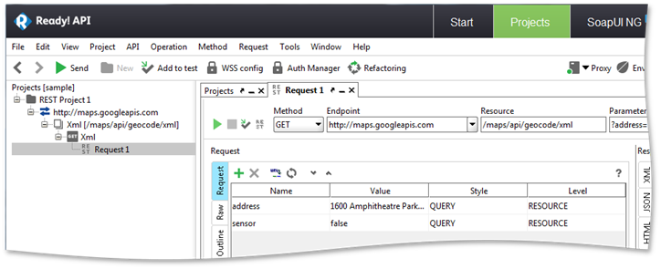
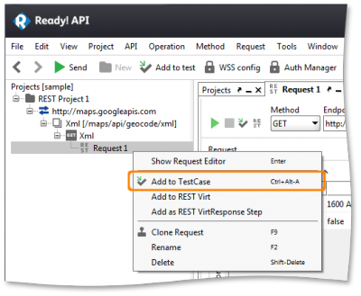
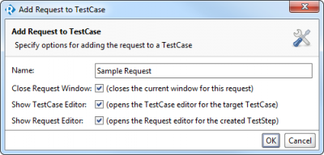

# 2.2 Test Case Creation

You can now click to send individual requests to the service. Ready! API will display the response from the service once it is received.

To automate your tests, for example to send multiple requests at once or create [data-driven tests](http://readyapi.smartbear.com/soapui/data_driven/start), you need to create a SoapUI NG test:

* Right-click the REST request and select **Add to TestCase**. 

* Specify the name of the TestSuite and TestCase that will contain the request. SoapUI NG will create a TestSuite and TestCase for the request.
* Specify the name of the request and leave the rest of the options the same. Click **OK**

Ready! API will create a SoapUI NG test.

