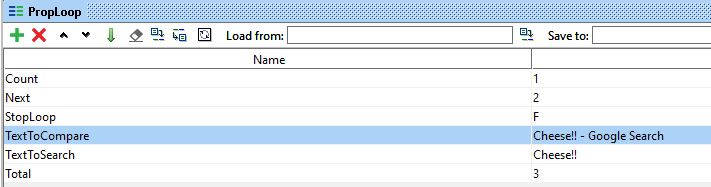
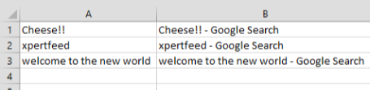

# 2.4 Data Driven Testing

In SoapUI to perform data driven testing please follow the below steps

1. Create the property step for performing looping operation



1. Create the Data Driver for performing data driving

```text
package kiran

import com.eviware.soapui.support.XmlHolder
 import org.apache.poi.xssf.usermodel.*
import org.apache.poi.xssf.usermodel.XSSFWorkbook

// DECLARE THE VARIABLES 
def myTestCase = context.testCase //myTestCase contains the test case
def counter,next,previous //Variables used to handle the loop and to move inside the file
//file containing the data
def fs = new FileInputStream("C:\\SaiKiran_Nataraja\\TestData\\dataFile.xlsx")
def wb = new XSSFWorkbook(fs)
//Enter the sheet in which data needs to be searched: sheet1
def ws = wb.getSheet("Sheet1")
//get the number of rows, each row is a data set
def size = ws.getPhysicalNumberOfRows()
//log.info totalRows
propTestStep = myTestCase.getTestStepByName("PropLoop") // get the Property TestStep object
propTestStep.setPropertyValue("Total", size.toString())
counter = propTestStep.getPropertyValue("Count").toString() //counter variable contains iteration number
counter = counter.toInteger()  
def TextToSearch
def TextToCompare
def row = ws.getRow(counter)
def totColumns = row.getPhysicalNumberOfCells()
// OBTAINING THE DATA YOU NEED
TextToSearch = row.getCell(0).getStringCellValue() // getCell(column)
TextToCompare = row.getCell(1).getStringCellValue() // getCell(column)
//log.info TextToSearch

next = (counter > size-2? 0: counter+1) //set the next value
//close the file
wb.close() 
propTestStep.setPropertyValue("TextToSearch", TextToSearch) //the value is saved in the property 
propTestStep.setPropertyValue("TextToCompare", TextToCompare) //the value is saved in the property 
propTestStep.setPropertyValue("Count", next.toString()) //increase Count value
next++ //increase next value

propTestStep.setPropertyValue("Next", next.toString()) //set Next value on the properties step
//Decide if the test has to be run again or not
if (counter == size-1){
    propTestStep.setPropertyValue("StopLoop", "T")
    log.info "Setting the stoploop property now..."
}else if (counter==0){
    def runner = new com.eviware.soapui.impl.wsdl.testcase.WsdlTestCaseRunner(testRunner.testCase, null)
    propTestStep.setPropertyValue("StopLoop", "F")
}else{
    propTestStep.setPropertyValue("StopLoop", "F")
}
```

1. Create the data loop groovy script

```text
def myTestCase = context.testCase
def runner

propTestStep = myTestCase.getTestStepByName("PropLoop") // get the Property TestStep
endLoop = propTestStep.getPropertyValue("StopLoop").toString()

if (endLoop.toString() == "T" || endLoop.toString()=="True" || endLoop.toString()=="true"){
    log.info ("Exit Groovy Data Source Looper")
    assert true
}else{
    testRunner.gotoStepByName("DataDriver") //setStartStep
}
```

4 . In the main test case, call the property in which ever means you want to. If it is a groovy script then call it using below line of code

```text
def searchString = myTestCase.getTestStepByName("PropLoop").getPropertyValue("TextToSearch").toString()
```

To run it as data driven testing run it in test case mode so that it repeats for the number of iterations based on the excel data you have passed.



Thanks for reading this portion. If you like it please share...

