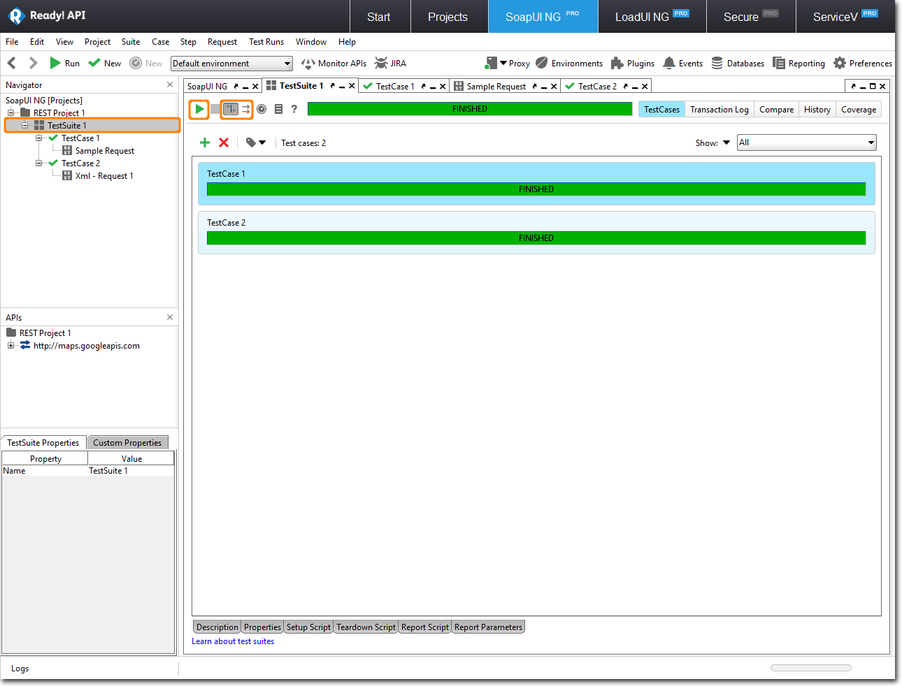

# 3.3 Running Test From Project Level

To run multiple Test cases or multiple test suites, click in the respective window. By default, Test cases and test suites are executed in a sequence. You can click to run them in parallel.

