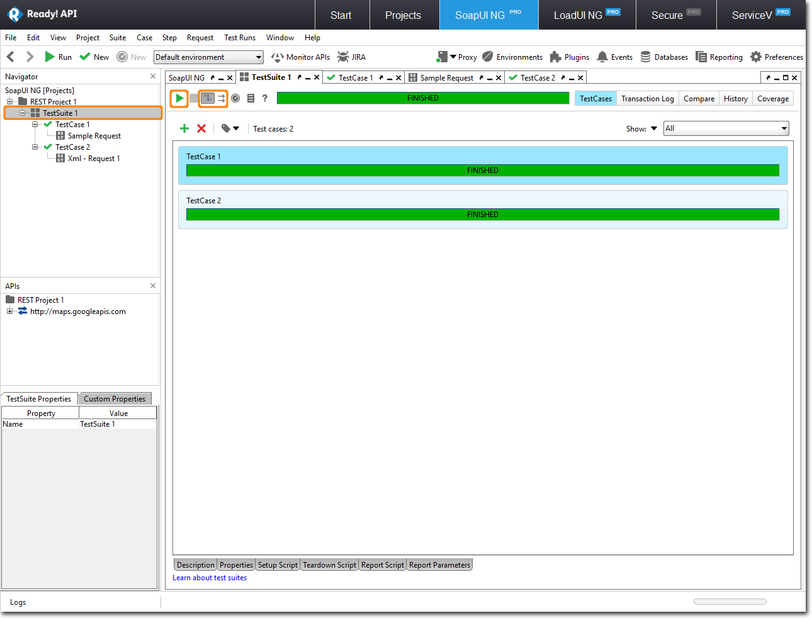

### **Creation of Project:** {#creation-of-project}

---

To start working with the SOAP UI NG, we need to create a project containing the API that will be used to access it:

* Select **File \| New Project**. 
* In the dialog, select the option you need. For this tutorial we will use Google Maps REST service, so switch to **URI** tab. Ready! API has several ways to add SOAP and REST services to the project, you can use WSDL, WADL, Swagger, and even use Ready! API internal browser to access APIs, use REST URI. 
* Enter the following URI and click **OK**: [http://maps.googleapis.com/maps/api/geocode/xml?address=1600+Amphitheatre+Parkway,+Mountain+View,+CA&sensor=false](http://maps.googleapis.com/maps/api/geocode/xml?address=1600+Amphitheatre+Parkway,+Mountain+View,+CA&sensor=false) 
* Ready! API will display the **Project is Created** dialog.
  * Select Continue to describe your API to stay in the Projects tool and keep working on your API.
  * Or select Create TestCase to create a SoapUI NG test and start working on it.

