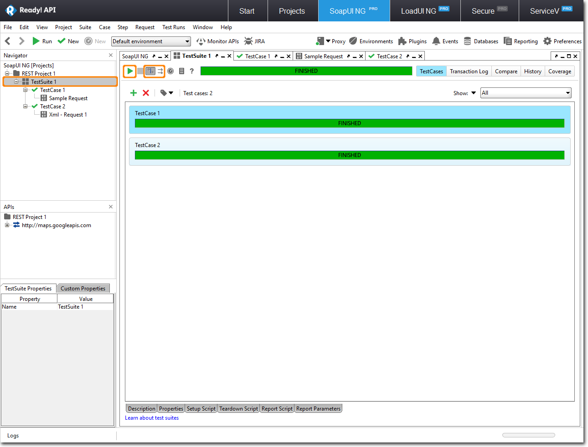

### **Running Tests From TestSuites And Projects** {#running-tests-from-testsuites-and-projects}

To run multiple TestCases or multiple test suites, click in the respective window. By default, TestCases and test suites are executed in a sequence. You can click to run them in parallel.

**Report Generation in SoapUI NG Pro**

Report generation in SoapUI NG Pro can be done in 3 different hierarchies.

1.  **Test Case Level**

For generation of report in the test case level, Click on the three lines to create a report for the test case

Below window is displayed with the options to display in the report.Select the required ones and click on ”Ok” to generate the report.

Now, the print preview of the report is displayed.

Click on the Save (Floppy Icon) button to create report in the desired format

Based on the format selection the report is saved.(Here selected in PDF format)

1.  **Test Suite Level**

For generation of report in the test case level, Click on the three lines to create a report for the test suite.

Below window is displayed with the options to display in the report.Select the required ones and click on ”Ok” to generate the report.

Now, the print preview of the report is displayed. Click on the Save (Floppy Icon) button to create report in the desired format.

Based on the format selection the report is saved. (Here selected in PDF format)

1.  **Project Level**

For generation of report in the test case level, Click on the three lines to create a report for the project.

Below window is displayed with the options to display in the report.Select the required ones and click on ”Ok” to generate the report.

Now, the print preview of the report is displayed.

Click on the Save (Floppy Icon) button to create report in the desired format.

Based on the format selection the report is saved. (Here selected in PDF format)

Any one of the three reports can be shared across the stakeholders of the system based on their need.